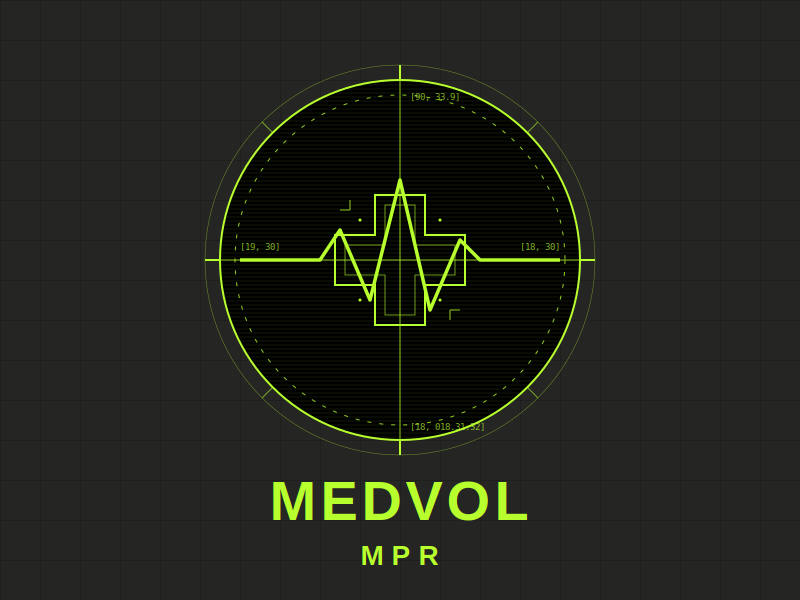
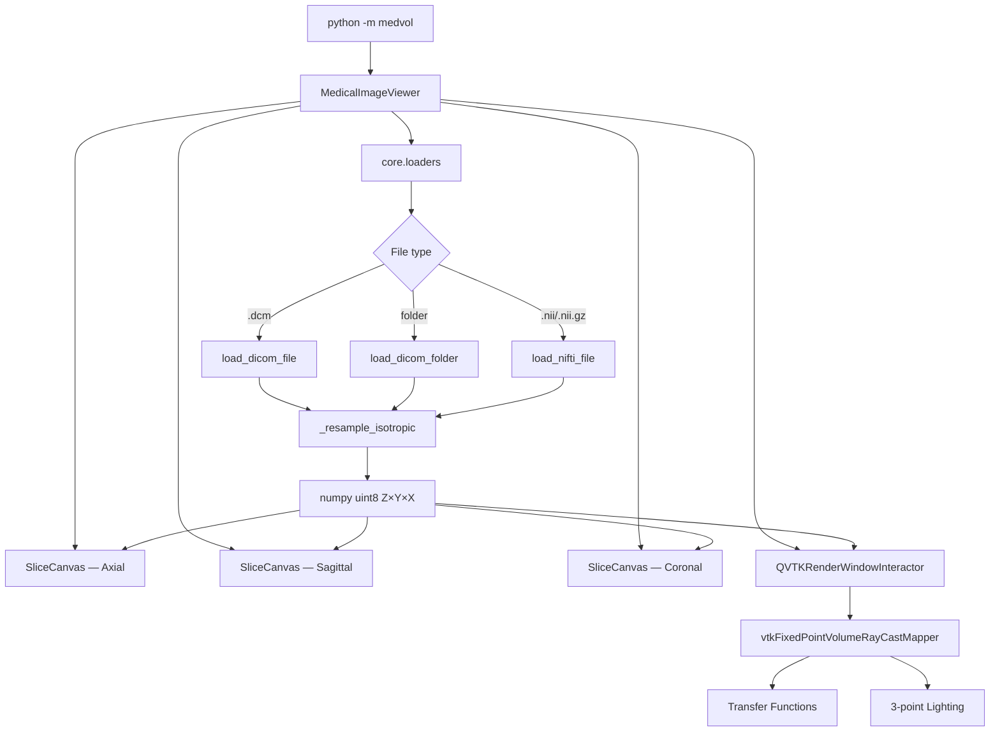

<div align="center">



# MEDVOL

### Open-source 3D medical image viewer — DICOM & NIfTI, zero configuration

<br/>

[](https://python.org)
[](https://riverbankcomputing.com/software/pyqt/)
[](https://vtk.org)
[](LICENSE)
[](CONTRIBUTING.md)
[](https://github.com/Kareem-Taha-05/medvol/actions)

<br/>


<br/><br/>

[**Documentation**](https://kareem-taha-05.github.io/medvol) &nbsp;·&nbsp;
[**Report a Bug**](https://github.com/Kareem-Taha-05/medvol/issues/new?template=bug_report.md) &nbsp;·&nbsp;
[**Request a Feature**](https://github.com/Kareem-Taha-05/medvol/issues/new?template=feature_request.md)

</div>

---

## What is MEDVOL?

Most medical viewers are either heavyweight clinical suites that take 20 minutes
to install, or research scripts that render a grey square and crash.
MEDVOL is neither.

It opens a NIfTI brain in three seconds, renders a full CT volume with
anatomically-correct tissue transfer functions, and keeps all three anatomical
planes in sync as you navigate. Built entirely on open-source Python:
**PyQt5 · VTK · Matplotlib · pydicom · nibabel**.

> **Not for clinical use.** Research and educational purposes only.

---

## Features

<table>
<tr>
<td align="center" width="33%">
<b>🧠 3D Volume Rendering</b><br/><br/>
Ray-cast VTK pipeline with tissue-specific transfer functions.
Air, fat, muscle, cartilage, and cortical bone all render with
distinct opacity and colour. Three-point lighting for depth.
</td>
<td align="center" width="33%">
<b>🔬 Linked Multi-planar Views</b><br/><br/>
Axial, sagittal, and coronal views stay perfectly in sync.
Click-drag anywhere to reposition all three crosshairs simultaneously
in real time.
</td>
<td align="center" width="33%">
<b>📐 Correct Voxel Spacing</b><br/><br/>
Reads <code>PixelSpacing</code>, <code>SliceThickness</code>, and
<code>SpacingBetweenSlices</code> from DICOM/NIfTI headers.
Resamples to isotropic voxels so scans are never stretched.
</td>
</tr>
<tr>
<td align="center" width="33%">
<b>📁 Any DICOM Format</b><br/><br/>
Single file, multi-frame enhanced DICOM, or a folder of series slices.
Auto-detects <code>SeriesInstanceUID</code>. Handles JPEG, JPEG 2000,
and RLE compression transparently.
</td>
<td align="center" width="33%">
<b>⚡ Efficient Loading</b><br/><br/>
Pixel data is read exactly once. Progress dialog with cancellation
for large series. Dimension-mismatch resolution for mixed-size series.
</td>
<td align="center" width="33%">
<b>🎨 Distinct UI</b><br/><br/>
Acid-green phosphor on concrete grey. Zero rounded corners.
The 3D view dominates the left column. Designed to be remembered,
not forgotten.
</td>
</tr>
</table>

---

## Quick Install

```bash
git clone https://github.com/Kareem-Taha-05/medvol
cd medvol
pip install .
python -m medvol
```

**With DICOM compression support** (JPEG / JPEG 2000 / RLE):

```bash
pip install ".[compress]"
```

<details>
<summary><b>Windows</b></summary>

`python-gdcm` on Windows includes its own DLLs — no external install needed.

</details>

<details>
<summary><b>macOS (Apple Silicon)</b></summary>

VTK's pip wheel may fail on arm64. If it does:

```bash
brew install vtk
pip install PyQt5 pydicom nibabel scipy scikit-image matplotlib
pip install --no-deps .
python -m medvol
```

</details>

<details>
<summary><b>Linux</b></summary>

```bash
sudo apt install libgl1-mesa-glx
pip install .
python -m medvol
```

</details>

---

## Usage

### GUI

```bash
python -m medvol
```

### Programmatic API

```python
from medvol.core.loaders import load_nifti_file, load_dicom_folder
from medvol.utils.image_processing import adjust_brightness_contrast

# Load a NIfTI volume — returns uint8 numpy array, shape (Z, Y, X)
volume = load_nifti_file("brain.nii.gz")
print(volume.shape)    # e.g. (182, 218, 182)

# Load a DICOM series folder
volume = load_dicom_folder("/path/to/CT_series/")

# Adjust a single slice
axial = volume[volume.shape[0] // 2]
adjusted = adjust_brightness_contrast(axial, brightness=20, contrast=60)
```

---

## Architecture



| Module | Responsibility |
|--------|---------------|
| `core/loaders.py` | All file I/O, voxel spacing, isotropic resampling |
| `core/volume_rendering.py` | Full VTK pipeline — import → TF → mapper → lighting → render |
| `ui/main_viewer.py` | Qt layout, mode control, mouse events, crosshair coordinate mapping |
| `ui/slice_canvas.py` | Horizontal-strip Matplotlib canvas widget |
| `utils/image_processing.py` | Singularity-free brightness/contrast |

---

## Supported Formats

| Format | Details | Requires |
|--------|---------|---------| 
| `.nii` / `.nii.gz` | NIfTI-1 and NIfTI-2 | Built-in (nibabel) |
| `.dcm` — uncompressed | Standard transfer syntax | Built-in (pydicom) |
| `.dcm` — JPEG | TS 1.2.840.10008.1.2.4.50 / .51 | `pylibjpeg` |
| `.dcm` — JPEG 2000 | TS 1.2.840.10008.1.2.4.90 / .91 | `python-gdcm` |
| `.dcm` — RLE | TS 1.2.840.10008.1.2.5 | `python-gdcm` |
| DICOM series folder | Sorted by `InstanceNumber` + `SeriesUID` | Built-in |
| Enhanced multi-frame | `NumberOfFrames > 1`, `SharedFunctionalGroupsSequence` | Built-in |

---

## Roadmap

- [x] NIfTI loading with isotropic resampling
- [x] DICOM single file, multi-frame, and series
- [x] Linked multi-planar crosshairs
- [x] VTK ray-cast volume rendering with anatomic transfer functions
- [x] Per-pane independent zoom
- [ ] Windowing presets (bone, lung, soft tissue, brain)
- [ ] Measurement tools (distance, angle, ROI)
- [ ] DICOM metadata inspector panel
- [ ] Maximum Intensity Projection (MIP) mode
- [ ] Export slice / 3D render to PNG

---

## Compatible Public Datasets

| Dataset | Format | Link |
|---------|--------|------|
| IXI Brain Dataset | NIfTI | [brain-development.org](https://brain-development.org/ixi-dataset/) |
| OpenNeuro | NIfTI | [openneuro.org](https://openneuro.org) |
| TCIA Collections | DICOM | [cancerimagingarchive.net](https://www.cancerimagingarchive.net) |

---

## Contributing

```bash
git clone https://github.com/Kareem-Taha-05/medvol
cd medvol
pip install -e ".[dev]"
```

See [CONTRIBUTING.md](CONTRIBUTING.md) for code standards and how to add new file format support.

---

## License

MIT — see [LICENSE](LICENSE).

---

<div align="center">
Built with VTK · PyQt5 · pydicom · nibabel · Matplotlib<br/>
If this helped your work, a ⭐ means a lot.
</div>
