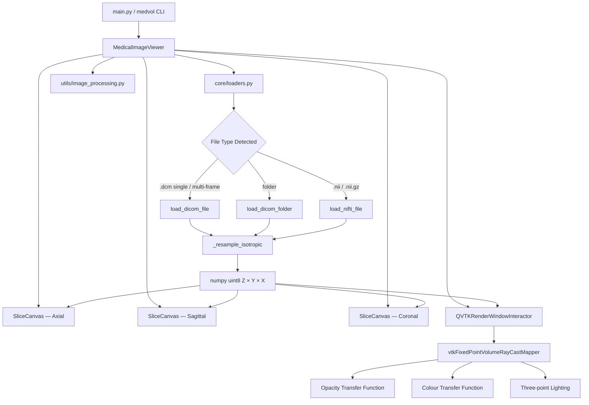
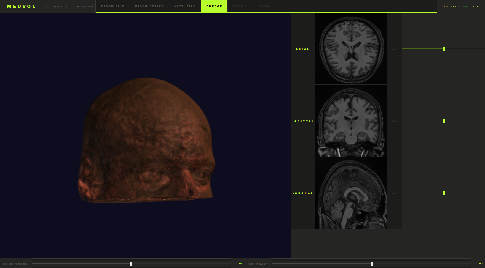
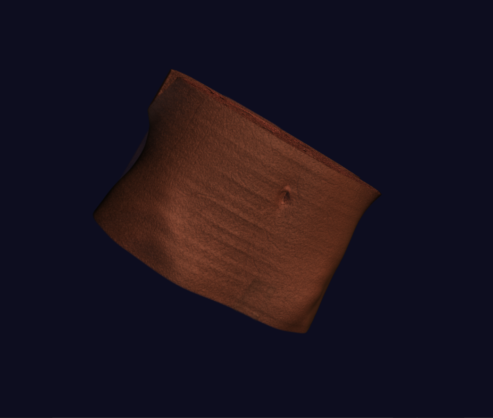

<div align="center">

<!-- Replace with your actual SVG logo -->


# MEDVOL

**Open-source 3D medical image viewer for DICOM and NIfTI volumes.**  
Built with PyQt5, VTK, and Matplotlib. No cloud. No setup wizard. No nonsense.

<br/>

[](https://python.org)
[](https://riverbankcomputing.com/software/pyqt/)
[](https://vtk.org)
[](LICENSE)
[](CONTRIBUTING.md)
[](https://github.com/YOUR_USER/medvol/actions)

<br/>

<!-- DEMO GIF — record and place at assets/demo/demo.gif -->
<!-- Keep under 10MB. Ideal: 800×450px, 15fps, 12 seconds -->


<br/>
<br/>

[**Live Web Demo**](https://YOUR_USER.github.io/medvol/demo) · [**Documentation**](https://YOUR_USER.github.io/medvol) · [**Report a Bug**](https://github.com/YOUR_USER/medvol/issues/new?template=bug_report.md) · [**Request a Feature**](https://github.com/YOUR_USER/medvol/issues/new?template=feature_request.md)

</div>

---

## Why MEDVOL?

Most medical viewers are either bloated clinical suites that take 20 minutes to install, or research scripts that show a grey square and crash. MEDVOL is neither.

It opens a NIfTI brain in three seconds, renders a full CT volume with anatomically-correct transfer functions, and stays out of your way.

---

## Features

<table>
<tr>
<td align="center" width="33%">
<h3>🧠 Volume Rendering</h3>
Ray-cast VTK pipeline with tissue-specific transfer functions — air, fat, muscle, and cortical bone all render distinctly. Three-point lighting for depth.
</td>
<td align="center" width="33%">
<h3>🔬 Linked Multi-planar</h3>
Axial, sagittal, and coronal views stay in sync. Click anywhere to move all crosshairs simultaneously. Zoom per-pane independently.
</td>
<td align="center" width="33%">
<h3>📐 Isotropic Resampling</h3>
Reads PixelSpacing and SliceThickness from DICOM/NIfTI headers. Resamples to isotropic voxels before display — no more stretched scans.
</td>
</tr>
<tr>
<td align="center" width="33%">
<h3>📁 Any DICOM</h3>
Single file, multi-frame enhanced DICOM, or a folder of series slices. Auto-detects SeriesInstanceUID. Handles JPEG, JPEG 2000, and RLE compression.
</td>
<td align="center" width="33%">
<h3>⚡ Fast Loading</h3>
Two-pass loader reads pixel data exactly once. Progress dialog with cancel. Dimension mismatch resolution for mixed-size series.
</td>
<td align="center" width="33%">
<h3>🎨 Brutalist UI</h3>
Acid-green phosphor on concrete. Zero rounded corners. The 3D view dominates the left column. Designed to be unforgettable.
</td>
</tr>
</table>

---

## Tech Stack

<div align="center">

`Python 3.10+` &nbsp;·&nbsp; `PyQt5` &nbsp;·&nbsp; `VTK 9` &nbsp;·&nbsp; `Matplotlib` &nbsp;·&nbsp; `NumPy` &nbsp;·&nbsp; `SciPy` &nbsp;·&nbsp; `pydicom` &nbsp;·&nbsp; `nibabel` &nbsp;·&nbsp; `scikit-image`

</div>

---

## Installation

```bash
git clone https://github.com/YOUR_USER/medvol
cd medvol
pip install .
```

Launch:

```bash
medvol
```

Or run directly:

```bash
python -m medvol
```

### With DICOM compression support

For JPEG-compressed, JPEG 2000, and RLE DICOM files:

```bash
pip install ".[compress]"
# installs: pylibjpeg  pylibjpeg-libjpeg  python-gdcm
```

<details>
<summary><b>Platform notes</b></summary>

**Windows**: `python-gdcm` includes its own DLLs — no external install needed.

**macOS (Apple Silicon)**: Install VTK via Homebrew first if the pip wheel fails:
```bash
brew install vtk
pip install PyQt5 pydicom nibabel scipy scikit-image matplotlib
python -m medvol
```

**Linux**: You may need `libgl1` for VTK:
```bash
sudo apt install libgl1-mesa-glx
pip install .
```

</details>

---

## Usage

### Load a NIfTI volume

```python
# Programmatic loading (without the GUI)
from medvol.core.loaders import load_nifti_file

volume = load_nifti_file("brain.nii.gz")
# Returns uint8 numpy array, shape (Z, Y, X), isotropically resampled
print(volume.shape)   # e.g. (182, 218, 182)
```

### Load a DICOM series

```python
from medvol.core.loaders import load_dicom_folder

volume = load_dicom_folder("/path/to/CT_series/")
# Auto-sorts by InstanceNumber, resamples to isotropic voxels
```

### Load a multi-frame DICOM

```python
from medvol.core.loaders import load_dicom_file

volume = load_dicom_file("enhanced_ct.dcm")
# Reads SharedFunctionalGroupsSequence for correct spacing
```

### Programmatic brightness/contrast

```python
from medvol.utils.image_processing import adjust_brightness_contrast
import numpy as np

slice_2d = volume[91, :, :]   # axial midpoint
adjusted = adjust_brightness_contrast(slice_2d, brightness=30, contrast=60)
```

---

## Architecture



### Module responsibilities

| Module | Responsibility |
|--------|----------------|
| `core/loaders.py` | File I/O, voxel spacing, isotropic resampling |
| `core/volume_rendering.py` | Full VTK pipeline: import → TF → mapper → lighting → render |
| `core/dependencies.py` | Optional backend detection (gdcm, pylibjpeg) |
| `ui/main_viewer.py` | Qt layout, mode control, mouse events, crosshair logic |
| `ui/slice_canvas.py` | Matplotlib canvas widget, fixed-square image well |
| `utils/image_processing.py` | Brightness/contrast with no singularities |

---

## Supported File Formats

| Format | Details | Requires |
|--------|---------|---------|
| `.nii` / `.nii.gz` | NIfTI-1 and NIfTI-2 | Built-in (nibabel) |
| `.dcm` — uncompressed | Standard DICOM | Built-in (pydicom) |
| `.dcm` — JPEG | Transfer syntax 1.2.840.10008.1.2.4.50/51 | `pylibjpeg` |
| `.dcm` — JPEG 2000 | Transfer syntax 1.2.840.10008.1.2.4.90/91 | `python-gdcm` |
| `.dcm` — RLE | Transfer syntax 1.2.840.10008.1.2.5 | `python-gdcm` |
| DICOM folder series | Auto-sorted by InstanceNumber + SeriesUID | Built-in |
| Enhanced multi-frame | NumberOfFrames > 1, SharedFunctionalGroupsSequence | Built-in |

---

## Screenshots

<table>
<tr>
<td></td>
<td></td>
</tr>
<tr>
<td align="center"><em>Full window — brutalist phosphor UI</em></td>
<td align="center"><em>3D ray-cast volume with three-point lighting</em></td>
</tr>
</table>

---

## Roadmap

- [x] NIfTI loading with isotropic resampling
- [x] DICOM single file, multi-frame, and series
- [x] Linked multi-planar crosshairs
- [x] VTK ray-cast volume rendering with anatomic transfer functions
- [x] Per-pane zoom
- [ ] Windowing presets (bone, lung, soft tissue, brain)
- [ ] Measurement tools (distance, angle, ROI)
- [ ] DICOM metadata inspector panel
- [ ] Maximum Intensity Projection (MIP) mode
- [ ] Export slice / render to PNG

PRs for any roadmap item are welcome — see [CONTRIBUTING.md](CONTRIBUTING.md).

---

## Compatible Public Datasets

No medical data is included. Test with any of these freely available datasets:

| Dataset | Format | Source |
|---------|--------|--------|
| IXI Brain | NIfTI | [brain-development.org](https://brain-development.org/ixi-dataset/) |
| OpenNeuro | NIfTI | [openneuro.org](https://openneuro.org) |
| TCIA Collections | DICOM | [cancerimagingarchive.net](https://www.cancerimagingarchive.net) |
| Visible Human | DICOM | [nlm.nih.gov](https://www.nlm.nih.gov/research/visible/visible_human.html) |

---

## Contributing

Contributions are very welcome. If this is your first time contributing to an open-source project, MEDVOL is a good place to start — the codebase is modular and well-documented.

**Quick start:**

```bash
git clone https://github.com/YOUR_USER/medvol
cd medvol
python -m venv .venv && source .venv/bin/activate
pip install -e ".[dev]"
```

**Before submitting a PR:**

```bash
black medvol/
ruff check medvol/
```

See [CONTRIBUTING.md](CONTRIBUTING.md) for the full guide including code standards, how to run tests, and how to add new file format support.

---

## License

MIT — see [LICENSE](LICENSE) for full text.  
In short: use it, modify it, distribute it. Attribution appreciated but not required.

---

<div align="center">

Built with VTK · PyQt5 · pydicom · nibabel

If this helped your research or project, a ⭐ on GitHub means a lot.

</div>